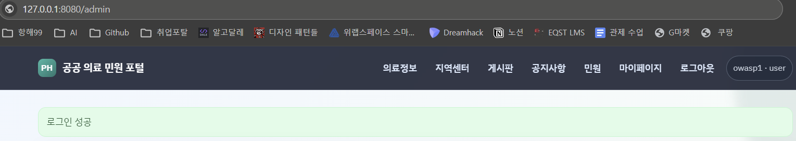
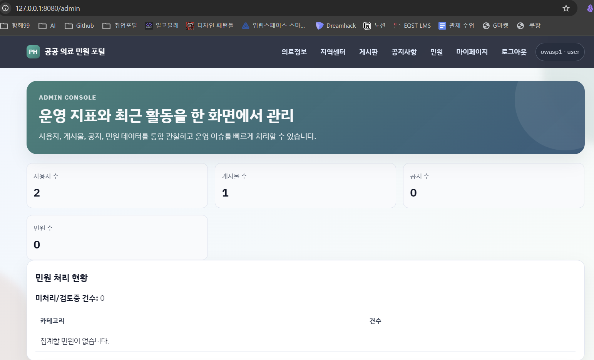
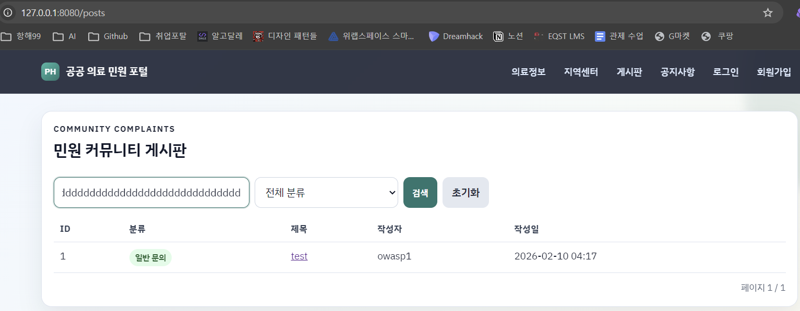
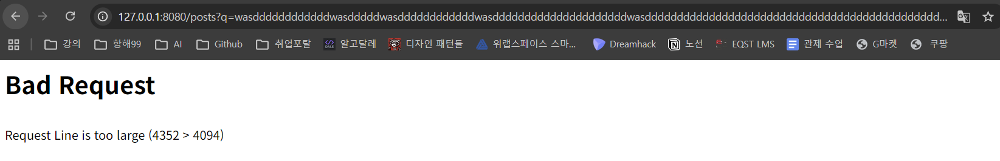
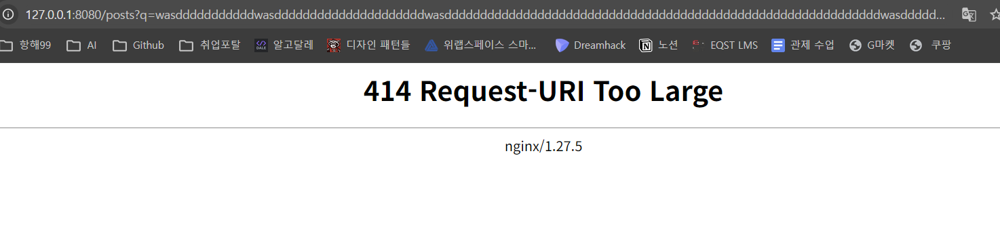

# [취약점 분석 보고서] OWASP Top 10 실습 결과
## 1. A01: Broken Access Control (취약한 접근 제어)
### 1.1 취약점 개요
취약점 명칭: 권한 상승을 통한 비인가 관리자 페이지 접근

관련 항목: OWASP Top 10:2021 - A01: Broken Access Control

위험도: High (상)

영향: 일반 사용자가 관리자 전용 경로인 /admin에 접근하여 시스템 설정 및 사용자 관리 기능을 임의로 조작할 수 있음.

### 1.2 취약점 상세 설명
서버가 특정 경로(Path)에 대해 '인증(Authentication)' 여부만 확인하고, 해당 사용자가 해당 자원을 사용할 권한이 있는지 '인가(Authorization)' 과정을 누락하여 발생함. 본 시스템은 owasp1이라는 일반 사용자 세션을 보유한 상태에서도 관리자 페이지인 /admin 접근 시 이를 차단하지 않고 정상적인 응답을 반환함.

### 1.3 재현 절차 (PoC)
일반 사용자 계정(username=owasp1, password=11111111)으로 /login에 접속하여 세션 쿠키를 획득함.

획득한 세션을 유지한 채 브라우저 또는 스크립트를 통해 http://127.0.0.1:8080/admin에 직접 접속을 시도함.

서버가 권한 부족(403 Forbidden) 에러를 뱉지 않고 200 OK 응답과 함께 관리자 페이지를 렌더링함을 확인함.

### 1.4 대응 방안
서버 측 인가 로직 구현: 모든 관리자 전용 라우터(Router) 상단에 세션의 권한 정보(role == 'admin')를 검증하는 미들웨어를 배치해야 함.

최소 권한의 원칙: 사용자의 역할에 따라 접근 가능한 자원을 화이트리스트(Whitelist) 방식으로 엄격히 통제함.

## 2. A10: Mishandling of Exceptional Conditions (예외 상황 처리 미흡)
### 2.1 취약점 개요
취약점 명칭: HTTP 요청 라인 임계값 초과 시 상세 설정 정보 노출

관련 항목: OWASP Top 10:2025 (Draft) - A10: Mishandling of Exceptional Conditions

위험도: Low to Medium (중하)

영향: 서버 내부의 상세 에러 메시지가 노출되어 공격자가 인프라의 설정 임계값을 파악하고 정교한 DoS 공격의 지표로 활용할 수 있음.

### 2.2 취약점 상세 설명
시스템이 예상치 못한 예외(Exception) 상황을 만났을 때, 이를 사용자에게 일반적인 메시지로 안내하지 않고 서버의 내부 동작이나 설정 임계값을 그대로 출력하는 결함임. /posts 검색 기능에서 비정상적으로 긴 쿼리 스트링을 전송할 경우, 서버가 허용하는 최대 길이 정보를 에러 메시지에 포함하여 반환함.

### 2.3 재현 절차 (PoC)
로그인이 필요 없는 게시판 검색 페이지(http://127.0.0.1:8080/posts)에 접속함.

q 파라미터에 약 5,500자 이상의 긴 문자열을 담아 GET 요청을 전송함.

서버 응답에서 "Request Line is too large (5539 > 4094)" 메시지를 확인하여 서버의 내부 요청 제한 임계값이 4094 바이트임을 파악함.

더 긴 문자열을 요청하면 nginx 버전까지 노출함.

### 2.4 대응 방안
Generic Error Messages: 상세 에러를 숨기고 "잘못된 요청입니다"와 같은 공통 에러 페이지를 반환하도록 전역 예외 처리기(@errorhandler)를 구현함.

Fail-Safe 원칙: 예외 발생 시 서버는 시스템의 내부 정보를 노출하는 대신 가장 보수적인 안전 상태(Fail-Close)를 유지해야 함.